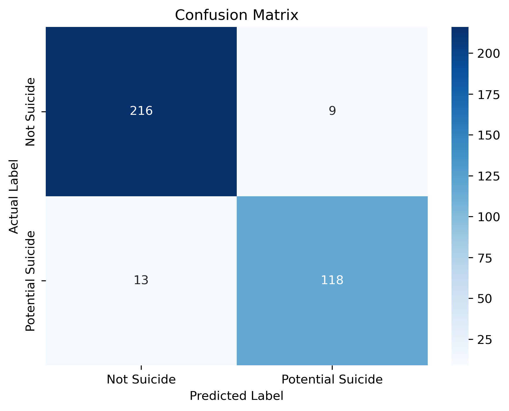

# Suicide Ideation Tweet Classification Using NLP

## Project Overview

This project uses Natural Language Processing (NLP) and machine learning to classify tweets into two categories:

- Not Suicide Post
- Potential Suicide Post

The goal of this project is to explore how machine learning and natural language processing can be used to identify patterns in text associated with potential suicide ideation.

The project follows an end-to-end machine learning workflow, including data exploration, data cleaning, TF-IDF text vectorization, model training, and model evaluation.

## Technologies Used

- Python
- Jupyter Notebook
- Pandas
- NumPy
- Matplotlib
- Seaborn
- Scikit-learn
- Natural Language Processing (NLP)
- TF-IDF
- Logistic Regression

## Model Performance

The Logistic Regression model achieved the following results on the test dataset:

| Metric | Score |
|---|---:|
| Accuracy | 94% |
| Precision | 93% |
| Recall | 90% |
| F1 Score | 91% |

The model achieved a 90% recall score for the Potential Suicide Post class.

## Methodology

The project followed these steps:

1. Loaded and explored the dataset
2. Examined class distribution
3. Handled missing values
4. Removed duplicate tweets
5. Cleaned and encoded target labels
6. Split the data into training and testing sets
7. Applied TF-IDF vectorization
8. Trained a Logistic Regression classifier
9. Evaluated model performance
10. Analyzed false positives and false negatives
11. Created a function to classify new tweets

## Model Evaluation

The model was evaluated using:

- Accuracy
- Precision
- Recall
- F1-score
- Confusion Matrix

Particular attention was given to recall for the Potential Suicide Post class because false negatives represent potentially concerning posts that the model did not identify.

## Future Improvements

Potential future improvements include:

- Comparing Logistic Regression with Linear SVM
- Hyperparameter tuning
- Testing different TF-IDF configurations
- Exploring advanced NLP models
- Increasing dataset size and diversity
- Improving model calibration

## Disclaimer

This project is intended as a machine learning and Natural Language Processing classification project.

The model should not be used as a diagnostic or clinical tool or to determine whether an individual is suicidal. Model predictions should be treated as classification outputs that may require appropriate human review.

## Confusion Matrix

The confusion matrix below shows the model's correct and incorrect predictions on the test dataset.

